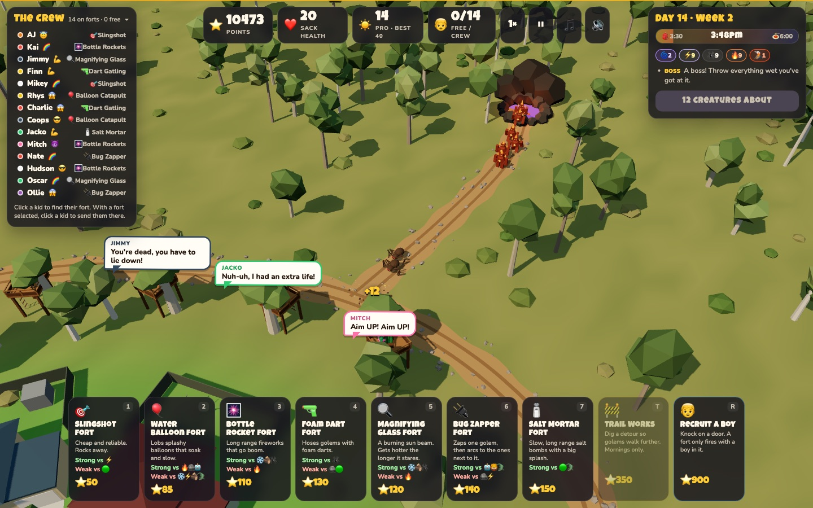
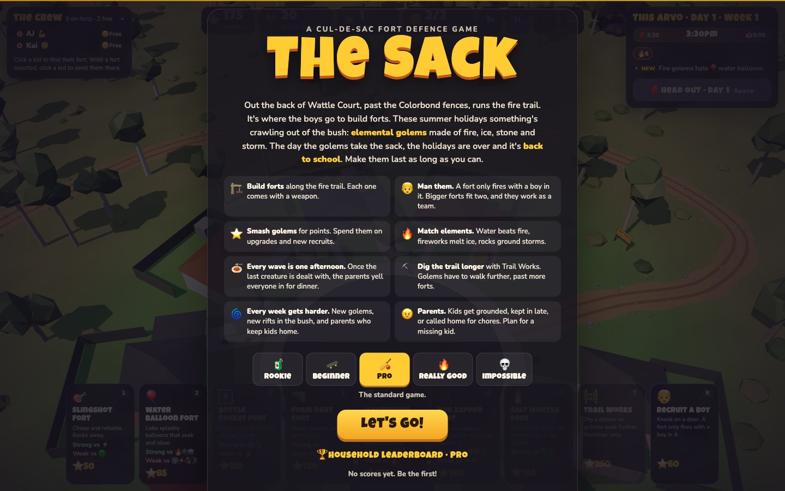
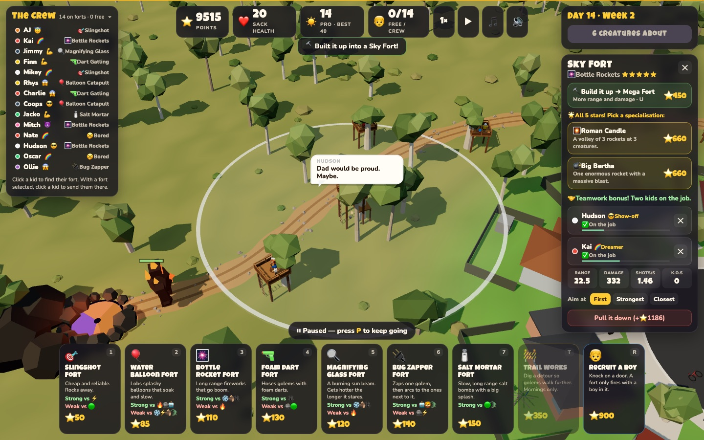
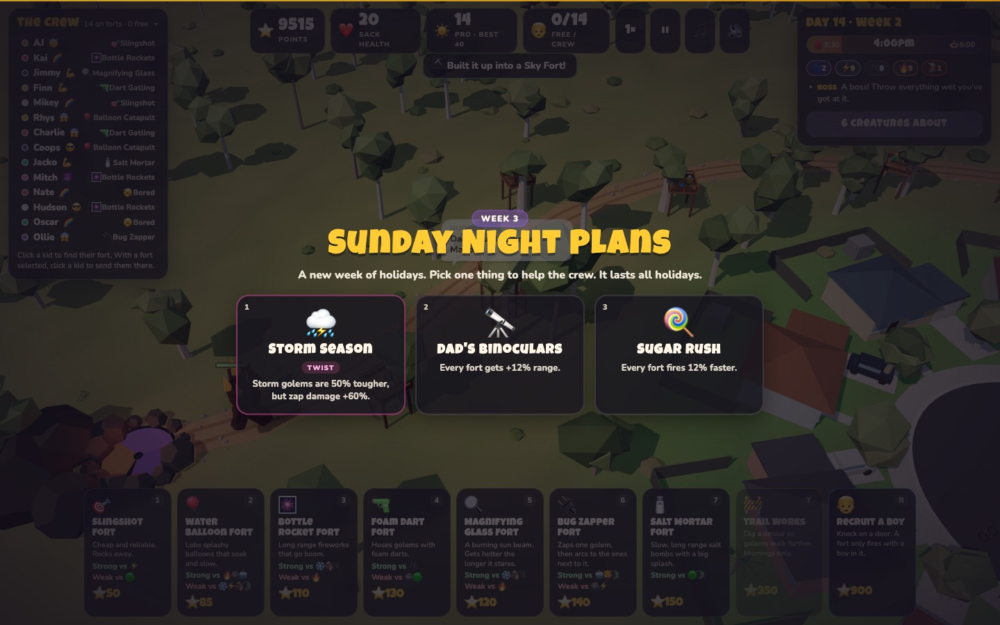
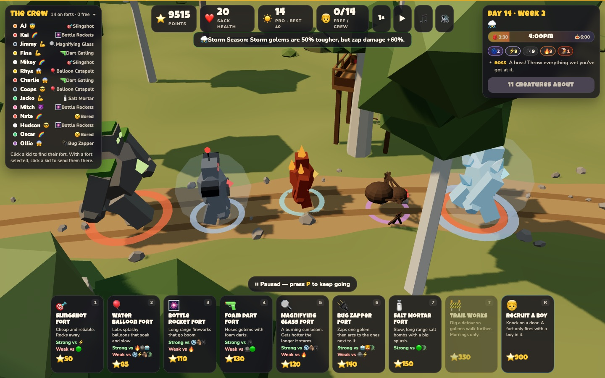
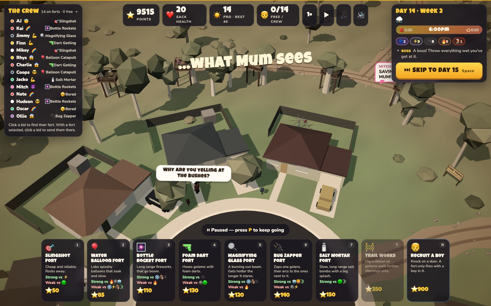
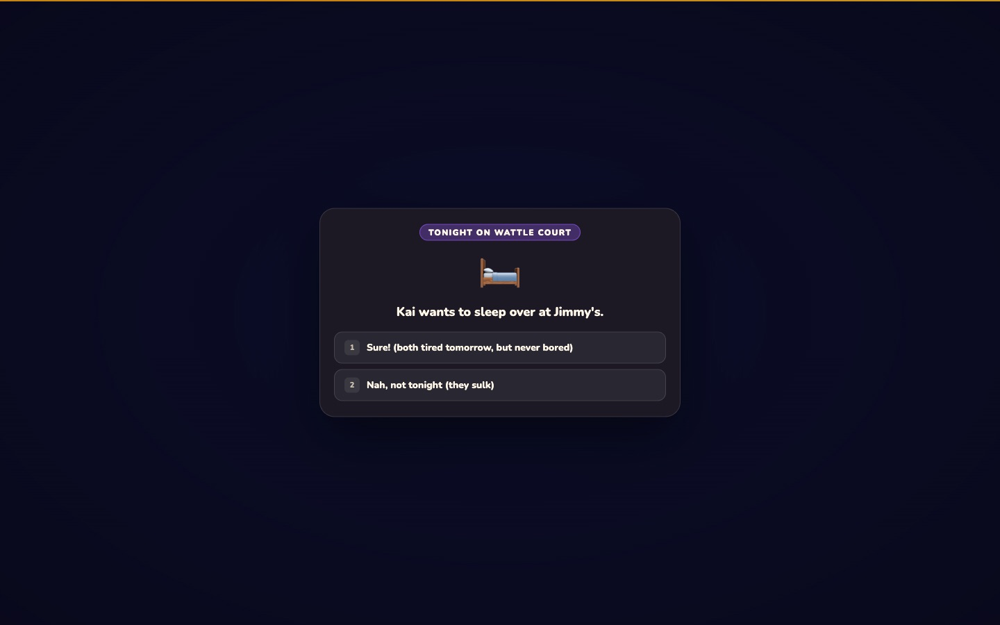
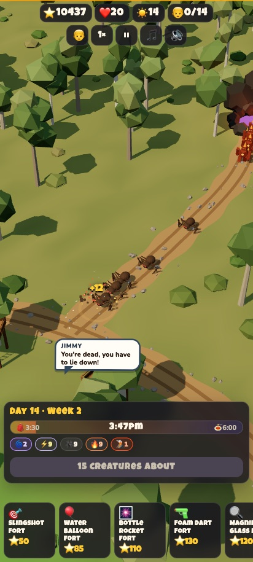

# The Sack

**A game by AJ and Kai**

A 3D fort-defence game. A crew of boys on a suburban cul-de-sac (Wattle Court) build forts along the fire trail behind their houses to hold off waves of elemental golems coming out of the bush.



## Screenshots

| | |
|---|---|
|  |  |
| **Title screen** with difficulties and the household leaderboard | **Specialisations** once a weapon has all 5 stars |
|  |  |
| **Sunday Night Plans**: a new pick each week | **Tougher variants** from week 5 |
|  |  |
| **…what Mum sees** at dusk | **Tonight on Wattle Court**: choices at the dinner table |

<p align="center"><br><b>On a phone</b></p>

## Run it on your computer

Needs [Node.js](https://nodejs.org) 18 or newer.

```bash
npm install
npm run dev       # open http://localhost:5173
```

The dev server also listens on your home network, so other computers, phones and tablets in the house can play at `http://<your-computer's-IP>:5173` (Vite prints the address when it starts).

To run the production build instead (what the Docker image runs):

```bash
npm run serve     # builds, then serves on http://localhost:8080
```

## Run it on the Unraid server (Docker)

Every push to `main` builds a Docker image and publishes it to `ghcr.io/trevbreak/the-sack:latest` (see the **Actions** tab). The image is a tiny Node server: it serves the game and keeps the household leaderboard in `/data/scores.json`.

**One-time setup:** the repo is private, so the image is too. Either:
- make the image public (GitHub → your profile → **Packages** → **the-sack** → **Package settings** → **Change visibility** → Public). The code stays private; only the built game is public. Or
- log Unraid in to GitHub's registry: in the Unraid terminal run `docker login ghcr.io -u trevbreak` and paste a [personal access token](https://github.com/settings/tokens) with the `read:packages` scope.

**Add the container (Unraid template):**
1. Copy `unraid/the-sack.xml` to `/boot/config/plugins/dockerMan/templates-user/my-the-sack.xml` on the server (e.g. through the `flash` share).
2. In Unraid: **Docker → Add Container → Template → the-sack**.
3. Check the port (8080) and the leaderboard folder (`/mnt/user/appdata/the-sack`), then **Apply**.
4. Play at `http://<unraid-ip>:8080` from any computer, phone or tablet in the house.

To update to the latest version: **Docker → the-sack → Force update**. The leaderboard lives in appdata, so it's kept.

**Or with Docker Compose** (any Docker host): `docker compose up -d`, then open port 8080. Use `docker compose up -d --build` to build from source instead of pulling.

## Household leaderboard

When the golems take the sack, type your name to save your run. Scores are kept on the server, so every computer in the house shares one leaderboard, one board per difficulty, ranked by days survived. The title screen shows the top 5 for the difficulty you've picked. If the server can't be reached, scores are saved in that browser instead.

## Phones and tablets

The game works with touch: drag to move, pinch to zoom, twist two fingers to rotate. Tap a fort card, then tap the map once to preview and again to build. Tap a fort to open it. On a phone you can use **Add to Home Screen** to play it full-screen like an app.

## How it plays

*   **Pick a difficulty** on the title screen. Your best day is saved separately for each:
    *   🧃 **Rookie**: weak creatures, lots of pocket money, a 30-health sack
    *   🛹 **Beginner**: a gentler holidays while you learn
    *   🏏 **Pro**: the standard game
    *   🔥 **Really Good**: tougher creatures, less money, stricter parents, a 15-health sack
    *   💀 **Impossible**: very tough creatures, a 10-health sack, and no overnight repairs

*   **Build forts** out in the bush along the fire trail. Each fort kit comes with a weapon:
    *   🎯 Slingshot Fort (impact): cheap, strong against Storm golems
    *   🎈 Water Balloon Fort (water, splash, slows): strong against Fire and Stone
    *   🎆 Bottle Rocket Fort (fire, splash, long range): strong against Ice
    *   🔫 Foam Dart Fort (foam, rapid fire): useless against Stone
    *   🔍 Magnifying Glass Fort (fire beam): heats up the longer it stays on one golem, up to 3×
    *   🔌 Bug Zapper Fort (zap): lightning that chains to 3 more golems
    *   🧂 Salt Mortar Fort (salt, long range, big splash): melts Goop
*   **Man them.** A fort only fires with a boy in it. Boys run from the sack to their fort. Each boy has a trait (Good Arm, Quick Hands, Eagle Eye, Fearless). From the Pallet Fort up, a fort fits **two kids**. They work as a team (+50% fire rate, +25% damage), and both kids' traits count. The crew goes up to 20 boys. AJ and Kai start, and Jimmy is the first recruit.
*   **Earn points** by smashing golems. Spend them on:
    *   building a fort up: Cardboard Box → Pallet Fort → Treehouse Tower → Sky Fort → Mega Fort
    *   weapon upgrades (up to ★★★★★)
    *   recruiting more boys from the street
    *   **Trail Works (T):** dig detours so golems walk further (Hairpin up the Ridge, Creek Bend, Big Loop past the Dam). They cost ⭐350, then ⭐600, then ⭐900, and can only be dug in the morning.
*   **Every wave is one day of the summer holidays.** Mornings are for building. When you head out, the clock runs from 3:30pm to 6pm. At 6pm the parents yell everyone in for dinner and any golems left slink back into the bush. Press Space to skip dinner, or to skip ahead once the trail is clear.
*   **Dinner waits for the last creature.** The 6pm dinner call only comes once every creature that day is smashed or has reached the sack, and the clock stretches to fit.
*   **The street takes a beating.** As the sack loses health, the houses visibly fall apart: smashed and boarded-up windows, fallen fences, flattened letterboxes, doors hanging off, cracked walls, and smoking holes in roofs. Overnight repairs fix a bit each morning.
*   **The holidays never end on their own.** They last until the golems take the sack, and then it's back to school. Your best day is saved as a high score. The sack gets 1 health back each morning.
*   **Every week gets harder:**
    *   Week 1: 🔥 Fire golems, then ⚡ Storm on day 4, then 🕷️ Huntsman Spiders on day 5 (pounce forward down the trail)
    *   Week 2 (day 8): a **second rift** opens in the north-east bush, and ❄️ Ice golems arrive. 🦁 **Sky Lions** on day 11: they fly above the trail, and lobbed weapons (balloons, salt) can't reach them
    *   Week 3 (day 15): 🪨 Stone golems, then 🟢 Goop on day 18 (splits in two when smashed)
    *   Week 4 (day 22): a **third rift** opens in the east paddock, near the houses, and 🤖 Robots arrive (armour cuts every hit). 🐨 **Drop Bears** on day 25: they leap onto the first manned fort they pass and scare the kids stiff for 4 seconds
    *   Week 5 (day 29): 🪵 Wood golems (regrow if you stop hitting them). 🐊 **Bunyips** on day 32: they dive underground every few seconds, where nothing can hit them
    *   Week 6 (day 36): a **fourth rift** opens down by the creek
    *   A 🌋 Magma Titan finishes every week (days 7, 14, 21…), with more of them as time goes on. Golem health and numbers keep climbing.
*   **Rifts:** golems from a new rift walk its own trail and join the main trail partway along, skipping any forts before the junction. Dormant rifts glow faintly in the bush before they open. When one opens, it happens in the morning, so you get time to build near its trail.
*   **Kids being kids:**
    *   **Personalities:** Dreamer 🌈, Focused 🎯, Sporty ⚡, Big Arm 💪, Show-off 😎, Bossy 📣 (boosts nearby forts), Goody-two-shoes 😇 (never in trouble), Ratbag 😈 (strong, always in trouble), Scaredy-cat 😱.
    *   **Boredom:** kids on quiet forts get bored (the bar under their name in the fort panel) and wander off to shoot hoops, do handstands or play Minecraft. The others complain. They come back on their own, or bribe them back with an icy pole 🍦. Put Focused kids on the quiet forts.
    *   **Chatter:** the kids talk, argue ("You're dead, lie down!" / "Nuh-uh, I had a force field!"), cheer, sulk and make their own sound effects.
    *   **Tonight on Wattle Court:** from day 3, some nights bring a choice at the dinner table (sleepovers, muddy shoes, broken windows, a little sister tagging along…) with consequences tomorrow.
    *   **What Mum sees:** sometimes at dusk a parent looks out, and for a moment it's just kids waving sticks at nothing.
*   **Sunday night plans:** at the start of every week from week 2, pick 1 of 3 cards that lasts the rest of the holidays: cheaper forts, faster kids, a free cousin, +30% to one damage type, or a **twist** with an upside and a downside (Heatwave, Cold Snap, Storm Season, Buried Treasure, Big Sleepover). Picks show as icons in the day panel.
*   **Tougher variants** (from week 5, day 29): some creatures turn up 🔺 Giant, 💨 Speedy, 🛡️ Shielded (a bubble soaks hits; zaps pop it 3× faster) or 🥚 Brood (bursts into 3 little ones). A coloured ring marks them. From about day 50 a few carry two.
*   **Specialisations:** once a weapon has all 5 stars, pick one of two specialisations, e.g. Sniper Slingshot or Scatter Shot, Roman Candle or Big Bertha, Tesla Coil or EMP Blaster, Rock Salt Cannon (can hit sky lions) or Salt Storm.
*   **Parents cause trouble**, more often each week:
    *   **Grounded** (from week 2): a kid stays home all day. You find out in the morning.
    *   **Late out** (from day 3): a kid has homework or a trip to Nan's first, and comes out mid-afternoon.
    *   **Chores**: a kid gets called home mid-afternoon ("BINS NEED TO GO OUT!") for about 14 seconds.
    *   Never more than a third of the crew is kept home on the same day.

## Controls

| Key | Action |
| --- | --- |
| 1–7 | Pick a fort to build (Shift-click to build several) |
| R | Recruit a boy |
| T | Trail Works |
| Space | Head out (start the day) |
| U / G | Build up selected fort / upgrade its weapon |
| Delete | Pull down selected fort |
| WASD / arrows | Move camera |
| Q / E, right-drag | Rotate camera |
| Scroll | Zoom |
| 1–3 (Sunday night) | Pick a card |
| F / P / M / N | Speed (up to 5×) / pause / mute / music |

## Code map

*   `src/config.js`: all the tuning (weapons, golems, costs, traits, wave generator)
*   `src/world.js`: the cul-de-sac, houses, fire trail, bush, golem rift
*   `src/path.js`: the fire trail curve golems follow
*   `src/golems.js`, `src/forts.js`, `src/boys.js`, `src/projectiles.js`: the actors
*   `src/game.js`: game loop, input, camera, waves, economy
*   `src/ui.js`, `src/style.css`, `index.html`: HUD and menus
*   `src/audio.js`: synthesized sound effects (no audio files)
*   `src/music.js`: the synthesized adventure theme